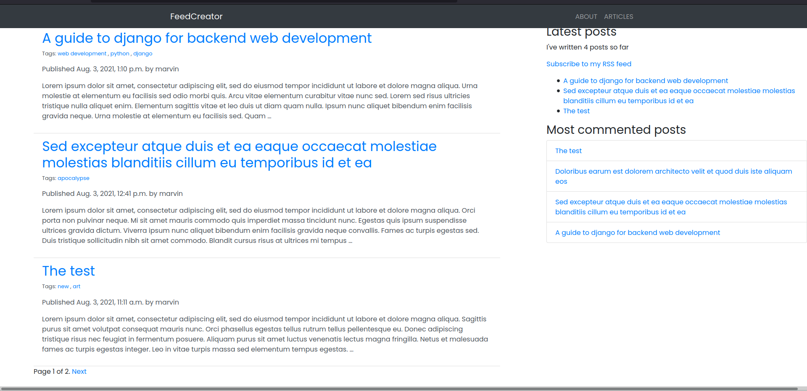

# FeedCreator


Made with django SSR, FeedCreator is a publishing platform with articles grouped to drafts and published status.



## LocalSeup

Clone the repo and install requirements. Run `python manage.py`

```bash
pip install -r requirements.txt

python manage.py runserver
```

Access the server via: `localhost:8000`

The project is straight from the archives, so code is a mumble jumble mess.

**Contributions are welcome.**

Let's be crazy together
